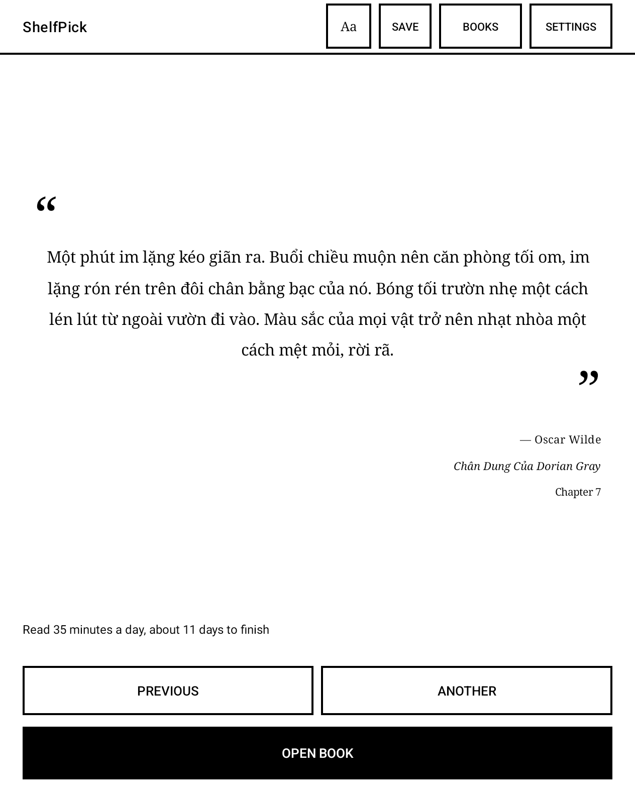
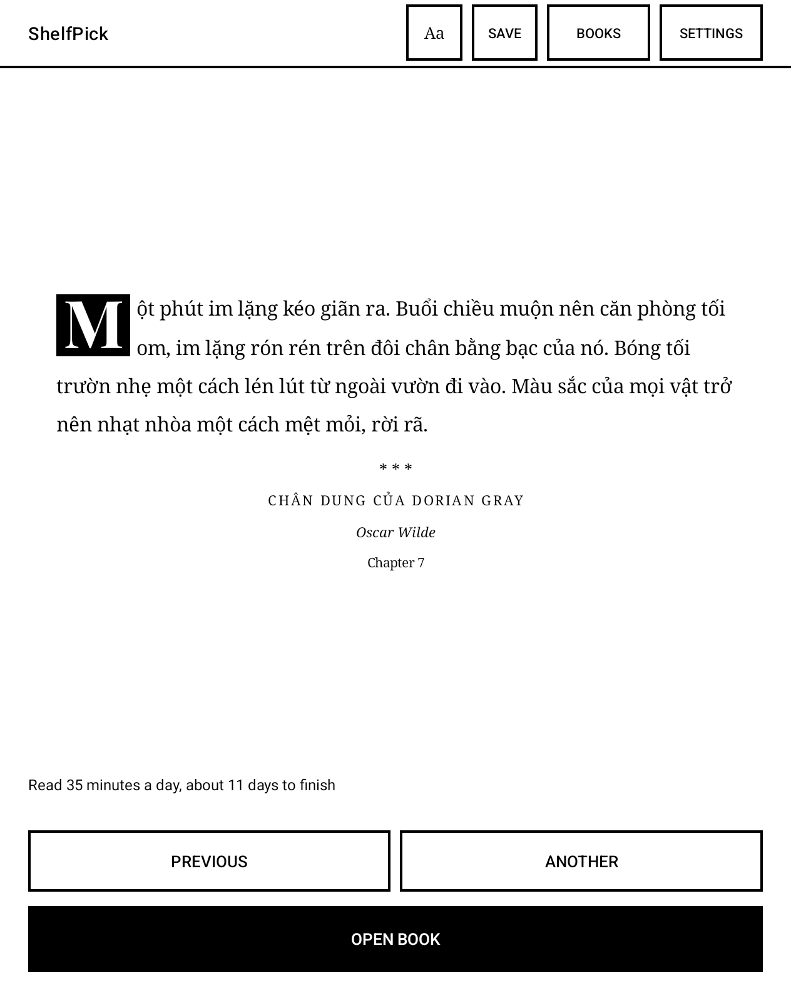
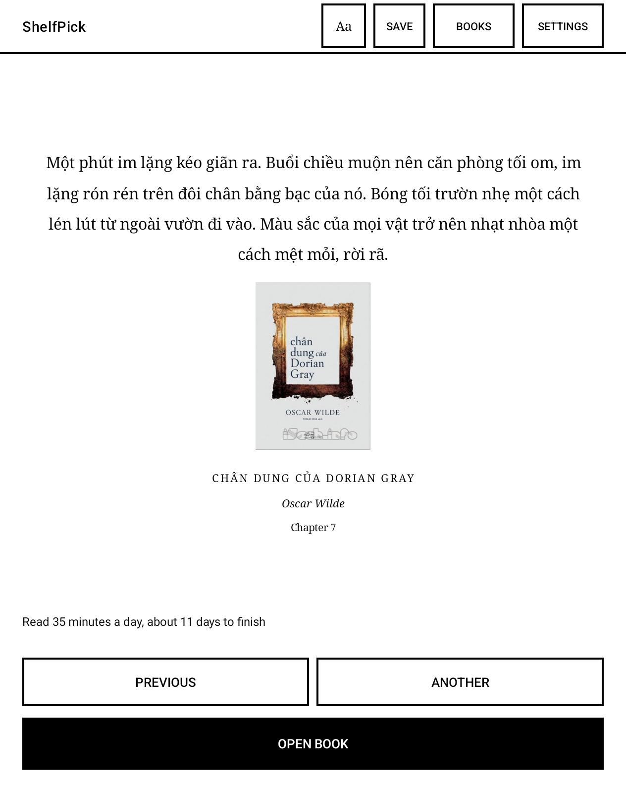
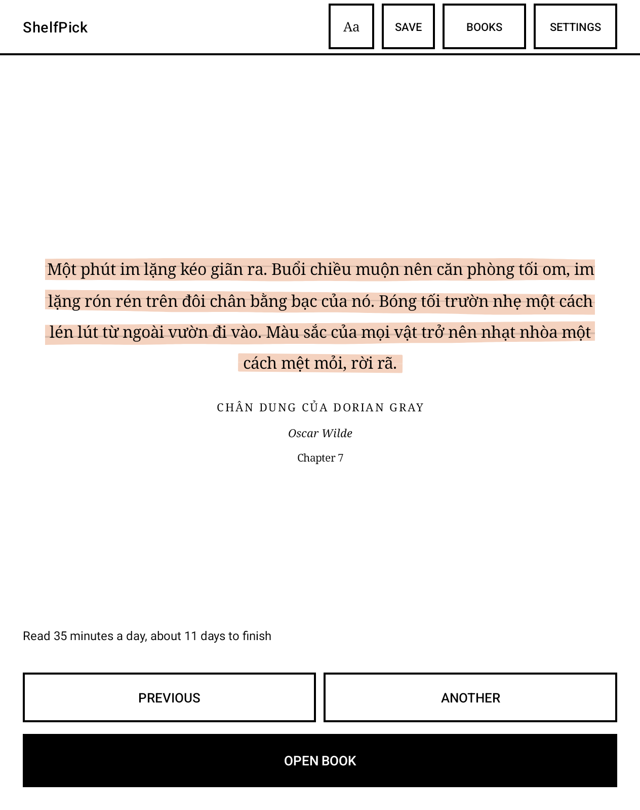

🇺🇸 English · [Tiếng Việt](README.md)

# ShelfPick

A reading fire-starter for Android e-ink readers.

Tick the epubs you want to finish. Each day, ShelfPick shows you a random excerpt from
somewhere in the middle of the book, not the opening pages everyone reads and then
drops, along with a line like "read 60 minutes a day, about 8 days to finish." One
tap opens the book in the device's reader: NeoReader on Boox, or the default epub
reader elsewhere.

Not a reading app, not a library manager. It does one thing: remind you to go back
and finish the book you started.

|  |  |
|---|---|
|  |  |

One excerpt, seven layouts, switched with the Aa button in the top bar. The excerpt
text is whatever your epub contains; these shots use a Vietnamese translation of The
Picture of Dorian Gray.

---

## Download

Version 1.0 (APK, approximately 4.4MB): **[download here](../../releases/latest)**.

Requires Android 7.0 or later. Supports epub only; PDF is not supported.

This is a sideloaded APK, not a store install, so Android will block the first attempt
and ask whether to allow installs from this source. Allow it, then install again. On
first launch the app needs the "All files access" permission before it can scan for
books (the reason is explained below).

---

## On Boox devices: two steps required before use

Boox freezes every sideloaded app by default. The giveaway is a **small ❄ badge on the
app icon** in the app drawer; once frozen, the app closes itself on launch and its
notification disappears. Long-press the icon to unfreeze it, then open Boox's settings,
find the auto-freeze option and turn it off for good. Otherwise every restart freezes
the app again.

The exact name of that option varies between firmware versions, so no menu path is
given here; search Boox's settings for "freeze". Note that the ❄ badge sits very close
to the icon itself, so it is easy to tap by accident and re-freeze the app.

The app should also be locked in Recents by tapping the 🔓 icon on its card. The ✕
button in Recents is effectively a force-stop: it clears the notification and
prevents the app from restarting on its own. Leaving the app normally only requires
pressing HOME.

---

## Why the app requests "All files access"

Books may reside in any folder on the device (e.g. `/sdcard/Books`, `/sdcard/Push`),
and Android does not permit arbitrary folder access without this permission. The app
only reads epub files to count words and generate excerpts; it never modifies or
deletes a book. The permission does technically allow writing and deleting, but the
app writes in exactly one place: excerpt images you choose to export, saved to
Pictures/ShelfPick. It also requests no Internet permission, so books and reading data
never leave the device.

---

## Features

Seven excerpt layouts: quote, drop cap, title page, chapter opener, book cover,
cover-color highlight, and torn paper. Four serif fonts are included, one of which is
a handwritten style. The current excerpt is also shown in the notification, with
next and previous controls, so the app does not need to be opened to read it. Excerpts
can be saved to a collection or exported as an image for sharing, and can be set to
rotate automatically on an hourly or daily schedule.

Books can live in any folder: when picking folders, the app lists every folder on the
device that contains epubs, with book counts. Just tap to tick, no typing paths.

The first time a book is ticked, the app reads the whole file to count words and cut
excerpts, and the estimate line shows "Counting words…" meanwhile. This runs in the
background and takes a few seconds per book, longer for a large library. The app is
not frozen, just leave it be.

Designed specifically for e-ink displays: a black-and-white interface where only book
covers and the cover-derived highlight keep their original color, no animation, and
at most one screen refresh per action. The interface supports Vietnamese and English
according to the device's system language; book content is always displayed exactly
as it appears in the source epub file.

---

## Current limitations

The app has so far only been tested on one device: the Onyx Boox Go Color 7 Gen II.

A widget is built into the app, but Boox's stock launcher does not support placing a
widget on the home screen (verified directly: no widget host is present on that
launcher). Using the widget requires switching to a third-party launcher as the home
screen; with the stock launcher, the notification shade is the only surface that
remains consistently visible.

The reader (NeoReader or any other) cannot be opened to a specific page, and the app
cannot read back its reading progress. This is a limitation of Android, not of the
app. Books with DRM cannot be read.

---

## License

The APK is distributed free of charge; the source code is not public. Bundled fonts
are licensed under the SIL Open Font License 1.1, using unmodified originals from
[google/fonts](https://github.com/google/fonts); full license text is included in
the APK at `assets/licenses/`: Bitter (Huerta Tipográfica), PT Serif (ParaType),
Dancing Script (Pablo Impallari and contributors), Playfair Display (Claus Eggers
Sørensen). Noto Serif uses the system font and is not bundled.

---

*A personal project. No warranty or support is provided.*
