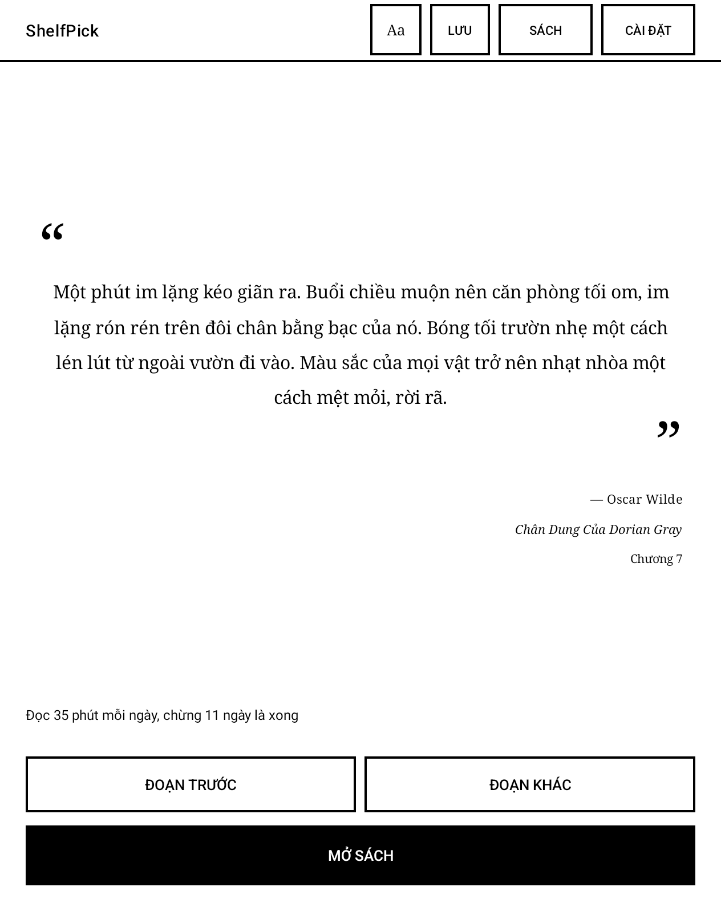
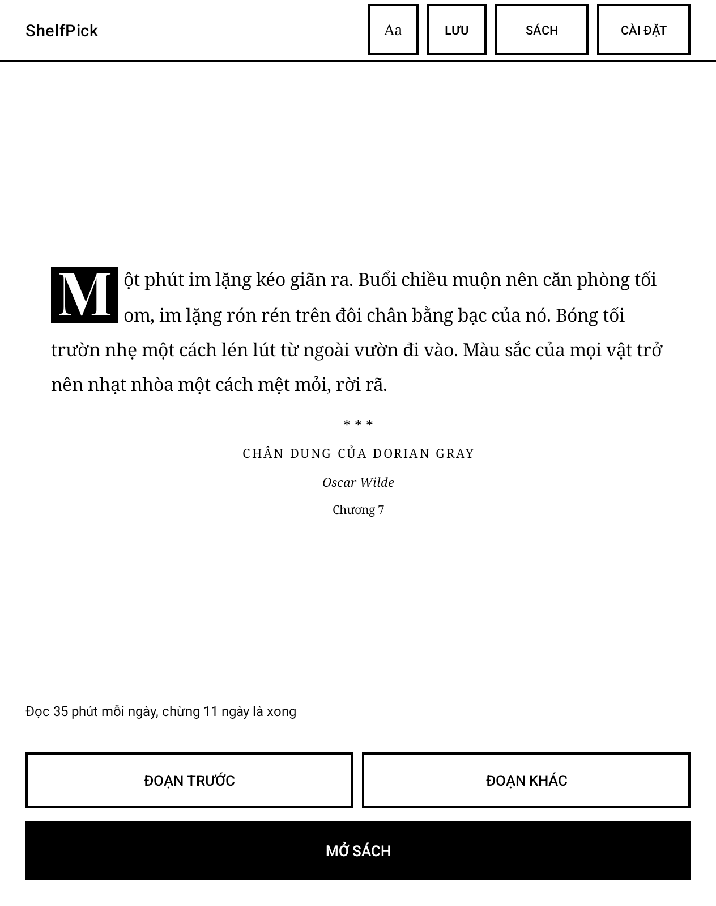
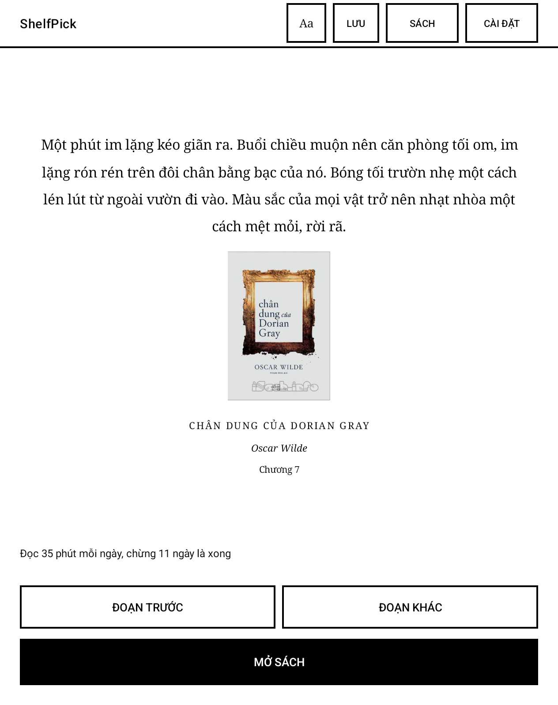
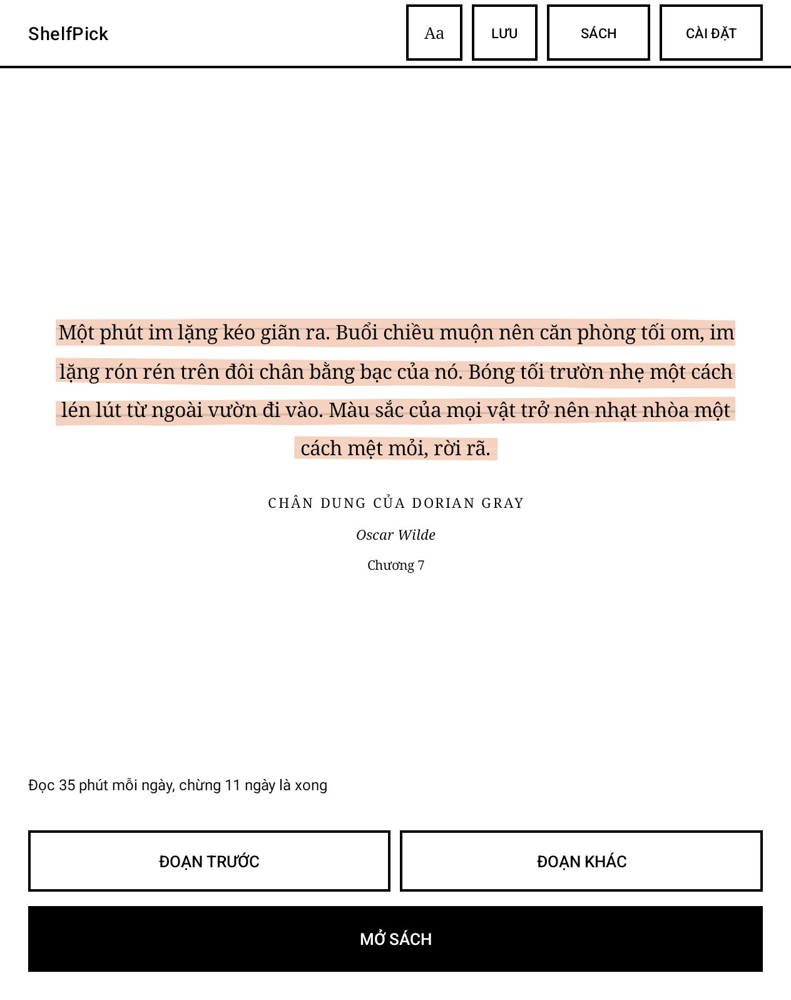

🇺🇸 [English](README.en.md) · Tiếng Việt

# ShelfPick

Mồi lửa đọc sách cho máy đọc sách Android màn e-ink.

Tick những cuốn epub bạn muốn đọc xong. Mỗi ngày ShelfPick hiện một đoạn trích ngẫu
nhiên ở đâu đó giữa sách, không phải phần mở đầu ai cũng đọc rồi bỏ, kèm một dòng ước
tính kiểu "đọc 60 phút mỗi ngày, khoảng 8 ngày là xong". Bấm một nút là mở thẳng sách
trong trình đọc của máy: NeoReader trên Boox, còn máy khác thì dùng trình đọc epub
mặc định.

Không phải app đọc sách, không phải app quản lý thư viện. Chỉ làm một việc: nhắc bạn
quay lại đọc nốt cuốn sách đang dở.

|  |  |
|---|---|
|  |  |

Một đoạn trích, bảy kiểu trình bày khác nhau, chuyển đổi bằng nút Aa ở thanh trên cùng.

---

## Tải về

Phiên bản 1.0 (APK, khoảng 4.4MB): **[tải tại đây](../../releases/latest)**.

Yêu cầu Android 7.0 trở lên. Chỉ hỗ trợ định dạng epub, không hỗ trợ PDF.

Đây là tệp APK cài tay, không qua cửa hàng ứng dụng, nên lần đầu Android sẽ chặn và
hỏi có cho phép cài từ nguồn này không. Chọn cho phép rồi cài lại. Mở ứng dụng lần
đầu, cần cấp quyền "Truy cập mọi tệp" thì mới quét được sách (lý do ở mục bên dưới).

---

## Trên máy Boox: hai việc cần làm trước khi sử dụng

Boox mặc định tự đóng băng mọi ứng dụng cài thêm. Dấu hiệu nhận biết là **biểu tượng ❄
nhỏ nằm ngay trên icon ứng dụng** trong danh sách ứng dụng; khi đã bị đóng băng thì mở
lên ứng dụng sẽ tự tắt và thông báo biến mất. Nhấn giữ icon để bỏ đóng băng, sau đó vào
phần cài đặt của Boox tìm mục tự động đóng băng ứng dụng và tắt hẳn nó đi. Không tắt
thì cứ mỗi lần khởi động lại máy là ứng dụng lại bị đóng băng.

Tên chính xác của mục này khác nhau tuỳ phiên bản firmware nên ở đây không ghi đường
dẫn menu cụ thể; cứ tìm theo từ khoá "đóng băng" hoặc "freeze" trong cài đặt của Boox.
Lưu ý biểu tượng ❄ nằm rất sát icon, dễ chạm nhầm thành đóng băng lại.

Nên khoá ứng dụng trong Recents bằng cách bấm biểu tượng 🔓 trên thẻ ứng dụng. Nút ✕
trong Recents thực chất là force-stop: nó xoá thông báo và khiến ứng dụng không tự
khởi động lại được. Để thoát ứng dụng bình thường, chỉ cần bấm HOME.

---

## Vì sao ứng dụng yêu cầu quyền "Truy cập mọi tệp"

Sách có thể nằm ở bất kỳ thư mục nào trên thiết bị (`/sdcard/Books`, `/sdcard/Push`…),
và Android không cho phép ứng dụng đọc thư mục tuỳ ý nếu thiếu quyền này. Ứng dụng chỉ
đọc tệp epub để đếm số từ và trích đoạn, không chỉnh sửa hay xoá tệp sách nào. Về mặt
kỹ thuật quyền này cho phép cả ghi và xoá, nhưng ứng dụng chỉ ghi đúng một chỗ: ảnh
trích đoạn bạn chủ động xuất, lưu vào Pictures/ShelfPick. Ứng dụng cũng không yêu cầu
quyền truy cập Internet, nên sách và dữ liệu đọc không rời khỏi thiết bị.

---

## Tính năng

7 kiểu trình bày trích đoạn: trích dẫn, chữ đầu phóng, trang tên sách, trang mở
chương, bìa sách, tô nền theo màu bìa, và xé giấy. Đi kèm 4 phông chữ serif, trong đó
có một phông dạng viết tay. Đoạn trích hiện hành cũng hiển thị ở thanh thông báo, kèm
nút chuyển đoạn tiếp theo hoặc trước đó, không cần mở ứng dụng để xem. Có thể lưu đoạn
trích yêu thích vào bộ sưu tập, hoặc xuất ra ảnh để chia sẻ. Đoạn trích cũng có thể tự
động thay đổi theo chu kỳ giờ hoặc ngày.

Sách nằm ở thư mục nào cũng dùng được: khi chọn thư mục, ứng dụng tự liệt kê các thư
mục trên máy có chứa epub kèm số cuốn, chỉ cần chạm để tick, không phải gõ đường dẫn.

Lần đầu tick một cuốn, ứng dụng phải đọc hết tệp để đếm số từ và cắt trích đoạn; trong
lúc đó dòng ước tính hiện "Đang đếm số từ…". Việc này chạy nền, mỗi cuốn mất vài giây,
thư viện lớn thì lâu hơn. Ứng dụng không treo, cứ để đó.

Thiết kế dành riêng cho màn hình e-ink: giao diện đen trắng, chỉ bìa sách và vệt màu
lấy theo bìa là giữ màu gốc; không hiệu ứng chuyển động, mỗi thao tác chỉ làm mới màn
hình tối đa một lần. Giao diện hỗ trợ tiếng Việt và tiếng Anh theo ngôn ngữ hệ thống
của thiết bị; nội dung sách luôn giữ nguyên theo tệp epub gốc.

---

## Giới hạn hiện tại

Ứng dụng mới được kiểm thử trên một thiết bị duy nhất: Onyx Boox Go Color 7 Gen II.

Widget đã được xây dựng sẵn trong ứng dụng, nhưng launcher mặc định của Boox không hỗ
trợ đặt widget lên màn hình chính (đã kiểm tra: launcher này không có widget host).
Muốn sử dụng widget cần thay thế bằng launcher khác làm màn hình chính; nếu giữ
nguyên launcher gốc, thanh thông báo là bề mặt hiển thị duy nhất luôn hiện diện.

Trình đọc (NeoReader hay app nào khác) không mở được sách đúng ở một trang cụ thể, và
ứng dụng cũng không thể đọc được tiến độ đọc từ trình đọc. Đây là giới hạn của Android,
không phải do ứng dụng. Sách có DRM không thể đọc được.

---

## Giấy phép

APK được phát hành miễn phí, mã nguồn không công khai. Phông chữ đi kèm sử dụng theo
giấy phép SIL Open Font License 1.1, là bản gốc chưa chỉnh sửa lấy từ
[google/fonts](https://github.com/google/fonts); toàn văn giấy phép được đóng gói
trong APK tại `assets/licenses/`: Bitter (Huerta Tipográfica), PT Serif (ParaType),
Dancing Script (Pablo Impallari và cộng sự), Playfair Display (Claus Eggers Sørensen).
Noto Serif sử dụng phông hệ thống, không đóng gói kèm ứng dụng.

---

*Dự án cá nhân. Không bảo hành, không cam kết hỗ trợ.*
